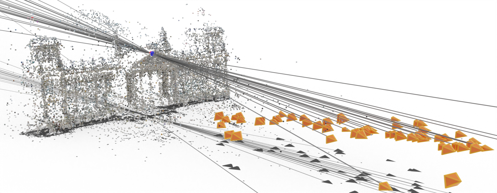
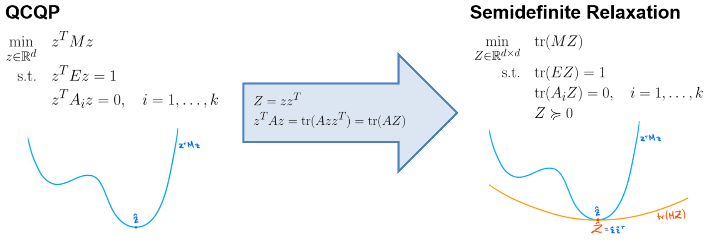
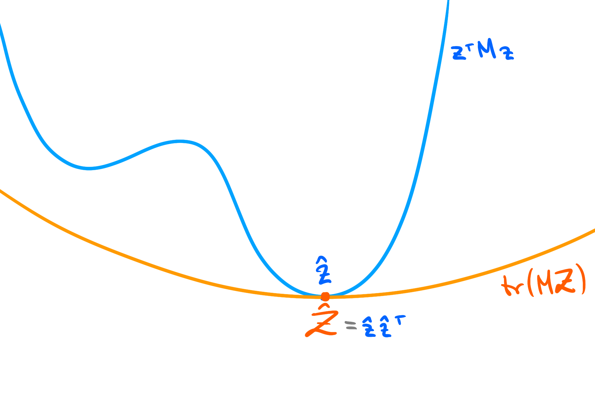
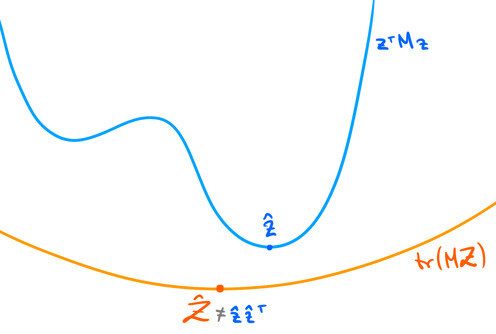

# Semidefinite Relaxations for Robust Multiview Triangulation

> **Semidefinite Relaxations for Robust Multiview Triangulation**
>
> [Linus Härenstam-Nielsen](https://cvg.cit.tum.de/members/hael)<sup>1,2</sup>, [Niclas Zeller](https://www.niclas-zeller.de/)<sup>4</sup> and [Daniel Cremers](https://vision.in.tum.de/members/cremers)<sup>1,2,3</sup><br>
> <sup>1</sup>Technical University of Munich, > <sup>2</sup>Munich Center for Machine Learning, <sup>3</sup>University of Oxford , <sup>4</sup>Karlsruhe University of Applied Sciences
>
> [**CVPR 2023** (arXiv)](https://arxiv.org/abs/2301.11431)

 Without outliers             |  With outliers
:-------------------------:|:-------------------------:
  | 

<span style="color:blue">Blue point:</span>: ground truth.
<span style="color:red">Red point:</span>: non-robust global optimum.
<span style="color:green">Green point:</span>: robust global optimum found by our proposed relaxation.

# 🪧 Overview

In this work, we propose two convex relaxations to the robust multiview triangulation problem. One based on epipolar constraints, and one based on the fractional reprojection equations. In both cases, we use a series of reparametrizations to write the problem as a Quadratically Constrained Quadratic Program (QCQP) - for which there is a well known relaxation technique which lifts the non-convex QCQP from the space of `d`-dimensional vectors to the space of `d` by `d` dimensional positive semidefinite matrices. The advantage of going to this higher dimensional representation is that the resulting problem is a convex semidefinite program, for which we can use standard solvers.



Convex relaxations enable certifiably optimal algorithms for robust triangulation, since after solving the relaxed problem we either have that 1) the relaxation is provably tight and we have found the globally optimal solution to the original problem, or 2) the relaxation is provably non-tight and we can report failure to find the global optimum.

 Tight relaxation            |  Non-tight relaxation
:-------------------------:|:-------------------------:
 | 

# ⚗️ Contributions

In this repo we implement four methods:

* `TriangulationSDR`: non-robust triangulation with epipolar constraints - Eq. (T)
* `RobustTriangulationSDR`: robust triangulation with epipolar constraints - Eq. (RT)
* `TriangulationFractionalSDR`: non-robust triangulation with fraction constraints - Eq. (TF)
* `RobustTriangulationFractionalSDR`: robust triangulation with fraction constraints - Eq. (RTF)

The two robust versions are our contributions, while the other two are reimplementations of [[1](https://arxiv.org/abs/1207.7160)] and [[4](https://arxiv.org/abs/1904.09661)] respectively. See the first few cells in `experiments.ipynb` for example use. Implementations are based on [cvxpy](https://www.cvxpy.org/) and we use [MOSEK](https://www.mosek.com/) as backend.

In the [paper](https://arxiv.org/abs/2301.11431) we show that the fractional relaxations will find the global optimum in most cases, even under extreme noise and outlier levels. While the epipolar relaxation will more often be non-tight for high noise and outlier levels, but with the advantage of being significantly faster.

# 🛠️ Setup and running

Make sure python 3.10 with virtualenv is installed, then run the following:

```
python3.10 -m virtualenv venv3.10
source venv3.10/bin/activate
python -m pip install -r requirements.txt
```

To fully replicate the results you will also need to [install MOSEK](https://www.mosek.com/downloads/). However it is also possible to use SCS by updating the experiment scripts accordingly, this will typically give the same results but with longer runtimes.

## Simulation experiments

In the simulation experiments we randomly generate triangulation problems by sampling cameras on a sphere and points close to the origin. See section 6.1 of the paper for details.
To run use:

```
python3 simulation_experiments.py
```

By default this will run 30 trials for each setting with 3, 5, 7 views. For other settings you'll at the moment need to modify the script manually.

## COLMAP experiments

In this experiment we retriangulate points based on matches from a high quality COLMAP reconstruction and add outliers by replacing the high quality matches with random keypoints in the image.

To run, first download the Reichstag dataset from the [image matching benchmark](https://www.cs.ubc.ca/~kmyi/imw2020/data.html), then:

```
python3 image_matching_experiments.py --data-dir [path to downloaded data directory]
```

# 🔬 Analyzing the results

Each experiment script generates a series of `.pickle` files storing the results. To analyze these we provide a notebook that can be used to replicate all the plots from the paper in `experiments.ipynb`

## Visualizations

The 3D plots in the paper were generated using Blender. To reproduce follow these steps:

* Install [Blender](https://www.blender.org/) and [blender-plots](https://github.com/Linusnie/blender-plots), we have used blender version 3.4.1 and blender-plots on commit [3afd4c7](https://github.com/Linusnie/blender-plots/tree/3afd4c7310f2c61885a9fdfda324df4e4ac208c7)
* Set up Blender notebook (with virtual environment activated):

```
python -m pip install blender_notebook
blender_notebook install --blender-exec=[path to blender executable] --kernel-name=blender-robust-triangulation
```

* Launch your preferred notebook editor (such as [VS code](https://code.visualstudio.com/))
* Open `experiments.ipynb` and set the kernel to `blender-robust-triangulation`

If everything is working correctly an instance of Blender should launch which is connected to the notebook for visualization.
